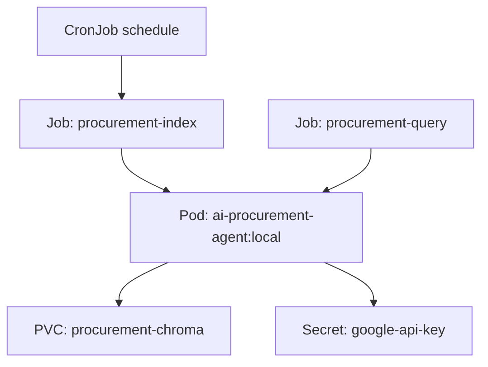
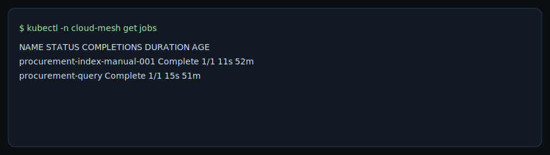

# K8s Procurement Pipeline Lab

Containerize and run the AI Procurement RAG pipeline on Kubernetes using Jobs, a PVC-backed index, and a scheduled CronJob. This lab is focused on operational readiness and reproducible batch execution.

## Contents
- [What I Built & Why](#what-i-built--why)
- [Architecture & Flow](#architecture--flow)
- [Components & Versions](#components--versions)
- [Runbook (Build -> Deploy -> Run -> Schedule)](#runbook-build---deploy---run---schedule)
- [Results & Evidence](#results--evidence)
- [Kubernetes Manifests](#kubernetes-manifests)

## What I Built & Why
- **Docker image**: containerized the procurement RAG CLI so it can run in a cluster.
- **Kubernetes Jobs**: run-to-completion batch pipeline for indexing and querying.
- **PVC-backed persistence**: Chroma index survives across Jobs to avoid re-indexing.
- **CronJob scheduling**: automated re-indexing with concurrency control.
- **Secret injection**: API keys stay out of git and are injected at runtime.

## Architecture & Flow


## Components & Versions
- Docker + local image `ai-procurement-agent:local`
- Kubernetes (kind) + kubectl
- PVC + Secret + Job/CronJob primitives

## Runbook (Build -> Deploy -> Run -> Schedule)
1) Build the container image (from the RAG lab):
   ```bash
   cd /path/to/ai-procurement-rag-lab
   docker build -t ai-procurement-agent:local .
   ```
2) Create a local Kubernetes cluster:
   ```bash
   kind create cluster --name cloud-mesh
   kubectl cluster-info
   ```
3) Load the local image into the cluster:
   ```bash
   kind load docker-image ai-procurement-agent:local --name cloud-mesh
   ```
4) Create namespace, Secret, and PVC:
   ```bash
   kubectl apply -f k8s/namespace.yaml
   kubectl -n cloud-mesh create secret generic google-api-key \
     --from-literal=GOOGLE_API_KEY='REPLACE_ME'
   kubectl apply -f k8s/pvc-chroma.yaml
   ```
5) Run the index Job:
   ```bash
   kubectl apply -f k8s/job-procurement-index.yaml
   kubectl -n cloud-mesh wait --for=condition=complete job/procurement-index --timeout=300s
   kubectl -n cloud-mesh logs job/procurement-index
   ```
6) Run the query Job:
   ```bash
   kubectl apply -f k8s/job-procurement-query.yaml
   kubectl -n cloud-mesh wait --for=condition=complete job/procurement-query --timeout=300s
   kubectl -n cloud-mesh logs job/procurement-query
   ```
7) Schedule re-indexing (CronJob) and validate manually:
   ```bash
   kubectl apply -f k8s/cronjob-procurement-index.yaml
   kubectl -n cloud-mesh create job --from=cronjob/procurement-index-cron procurement-index-manual-001
   kubectl -n cloud-mesh wait --for=condition=complete job/procurement-index-manual-001 --timeout=300s
   kubectl -n cloud-mesh logs job/procurement-index-manual-001
   ```
8) Cleanup:
   ```bash
   kubectl -n cloud-mesh delete job procurement-index procurement-query
   kubectl -n cloud-mesh delete cronjob procurement-index-cron
   kubectl -n cloud-mesh delete pvc procurement-chroma
   kind delete cluster --name cloud-mesh
   ```

## Results & Evidence
- CronJob manual run completes end-to-end (generate -> detect -> index) and persists the Chroma index.
- Query Job reads from the PVC without re-indexing.



## Kubernetes Manifests
- `k8s/namespace.yaml`: namespace for the demo.
- `k8s/secret.example.yaml`: safe example secret manifest.
- `k8s/pvc-chroma.yaml`: persistent storage for the Chroma index.
- `k8s/job-procurement-index.yaml`: generates data + indexes documents (PVC-backed).
- `k8s/job-procurement-query.yaml`: queries the existing index (PVC-backed).
- `k8s/cronjob-procurement-index.yaml`: scheduled re-indexing.
